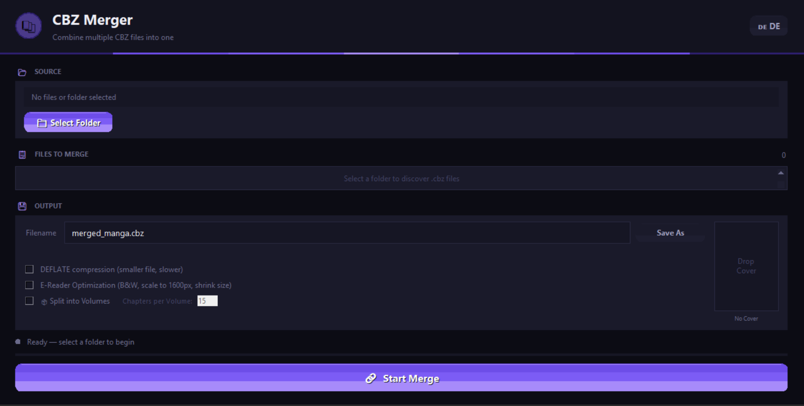

<div align="center">
  <h1>📚 CBZ Merger</h1>
  <p><strong>A blazingly fast, multi-threaded comic archive (.cbz) merger with a modern, responsive UI and E-Reader optimizations.</strong></p>

  <p>
    
    
    
  </p>
</div>

<br />

<p align="center">
  
</p>

## ✨ Features

- ⚡ **Multi-Threaded Performance**: Extracts and packages large comic/manga archives asynchronously. Uses all available CPU cores!
- 🎨 **Premium Dark Mode GUI**: Fully responsive custom-drawn `tkinter` canvas UI with smooth gradients and hover animations.
- 📱 **E-Reader Optimization Engine**: Specifically built for Kobo, Kindle, and e-ink displays. Shrinks file size by up to 50–70% via Grayscale conversion, downscaling, and JPEG compression.
- 🏷️ **Smart Cover & Metadata**: Auto-detects the first cover and displays a live thumbnail. You can drag and drop custom `.jpg` files as covers! Also auto-injects standard `ComicInfo.xml` metadata for your reading apps.
- 📦 **Volume Splitter**: Divides massive 5GB series into handy 15-chapter chunks (`Name_Vol_1.cbz`) automatically without blowing up RAM.
- 🎛️ **Advanced File Management**: Full control to manually re-sort chapters (⬆️/⬇️) or deselect individual files directly in the GUI. Features Drag & Drop support!
- 🌍 **Localization**: Real-time language switching capabilities (DE/EN) built right into the UI.
- 💻 **CLI Capability**: Headless use supported for automation via scripts.

---

## 🚀 Installation

### Option A: Standalone Executables (Recommended for non-developers)
You don't need to install Python! Simply navigate to the **[Releases](https://github.com/alxdru007/CBZ_Merger/releases)** page and download the pre-compiled standalone application for your system:
- 🪟 `CBZ_Merger_Windows.exe`
- 🍎 `CBZ_Merger_macOS.zip` (Extract to get the `.app`)
- 🐧 `CBZ_Merger_Linux` (Mark as executable before running)

### Option B: Run from Source (For developers)
Ensure you have **Python 3.8+** installed. 

1. **Clone the repository:**
```bash
git clone https://github.com/alxdru007/CBZ_Merger.git
cd CBZ_Merger
```

2. **Install the required dependencies:**
```bash
pip install -r requirements.txt
# OR install manually:
pip install Pillow tkinterdnd2
```

---

## 💻 Usage

### 🖼️ Graphical Interface (GUI)
The most convenient way to use the program is via its gorgeous interface.

```bash
python cbz_merger_gui.py
```
**How to use:**
1. Click **Select Folder** and navigate to the directory holding your individual chapter `.cbz` files.
2. Ensure the output target name looks correct (e.g., `MyManga_Volume1.cbz`).
3. *(Optional)* Toggle **E-Reader Optimization** if you want smaller files for e-ink devices.
4. Hit **🔗 Start Merge** and watch the multi-threaded progress bar fly!

### 🖥️ Command Line Interface (CLI)
You can easily automate your manga compilation using the script headless. 

```bash
# Basic usage (merges all files in the current folder):
python cbz_merger.py

# Specify Input & Output:
python cbz_merger.py C:/Manga_Scans/ C:/Books/Volume1.cbz

# Enable DEFLATE Archiving Compression:
python cbz_merger.py --compress

# Enable E-Reader Optimization (Grayscale / Resizing):
python cbz_merger.py --ereader ./ChapterFolder/ ./FinalBook.cbz
```

---

## 🛠️ Architecture

* `cbz_merger.py` - Core logic. Uses `concurrent.futures.ThreadPoolExecutor` to execute unzipping protocols concurrently and `xml.etree.ElementTree` to write dynamically chunked metadata XML trees.
* `cbz_merger_gui.py` - Custom-built `tkinter` / `tkinterdnd2` implementation featuring pure Canvas-based interactive elements (`GradientButton`, scrollable frames, image loading). Handles complex threading interrupts for safe user cancellations.

---

## 🤝 Contributing

Contributions, issues and feature requests are welcome! Feel free to check the [issues page].

## 📄 License
This project is [MIT](LICENSE) licensed. Feel free to use it, modify it, and distribute it!

<p align="center"><i>Crafted with passion for Manga & Comic enthusiasts!</i></p>
